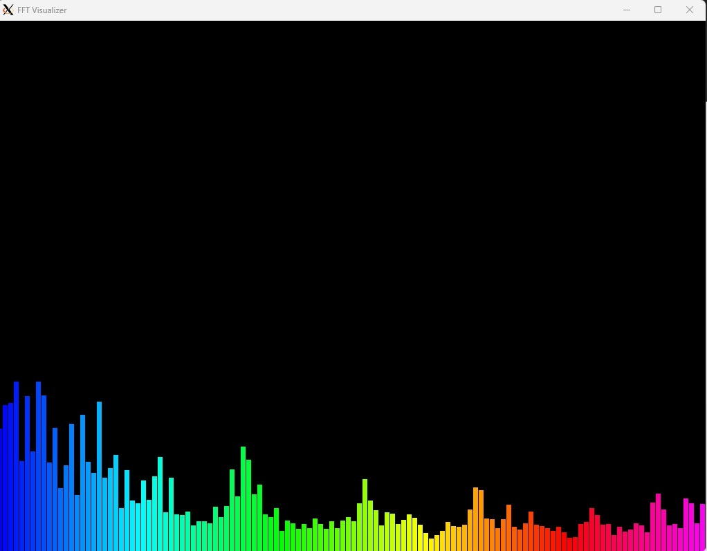

# FFT Visualizer

This project is an audio visualizer that uses the Fast Fourier Transform (FFT) to create a real-time spectral display of audio files.

## Sample



## Requirements

- Windows Subsystem for Linux (WSL) with Ubuntu
- X11 server for Windows (e.g., VcXsrv)
- SFML library
- FFTW3 library
- libsndfile library

## Setup for WSL

1. Install WSL with Ubuntu if you haven't already. Follow the [official Microsoft guide](https://docs.microsoft.com/en-us/windows/wsl/install).

2. Install an X11 server for Windows. Recommend VcXsrv: (Ignore if running natively):
   - Download and install [VcXsrv](https://sourceforge.net/projects/vcxsrv/).
   - Launch XLaunch and choose these settings:
     - Display number: 0
     - Start no client
     - Extra settings: Disable access control

3. In your WSL Ubuntu terminal, set the DISPLAY environment variable:
   ```
   echo "export DISPLAY=:0.0" >> ~/.bashrc
   source ~/.bashrc
   ```

4. Install the required libraries in WSL:
   ```
   sudo apt-get update
   sudo apt-get install libsfml-dev libfftw3-dev libsndfile1-dev g++
   ```

5. Clone this repository or copy the `main.cpp` and `r` files to your WSL environment.

6. Make the `r` script executable:
   ```
   chmod +x r
   ```

## Building and Running

1. Run the setup and build script:
   ```
   ./r
   ```

2. If the compilation is successful, you can run the program with:
   ```
   ./fft_visualiser path_to_your_audio_file.wav
   ```
   Replace `path_to_your_audio_file.wav` with the path to your mono WAV file.

## Troubleshooting

- If you see "Error: couldn't open display", make sure your X11 server is running and the DISPLAY variable is set correctly.
- If you encounter graphics-related errors, try updating your graphics drivers or using a different X11 server.
- Ensure your audio file is a mono WAV file. Stereo files are not supported.

## Notes

- The visualizer works best with mono WAV files.
- The window size is set to 1024x768 but can be adjusted in the code if needed.
- The visualization uses 128 bars with a color gradient from blue (low frequencies) to red (high frequencies).

